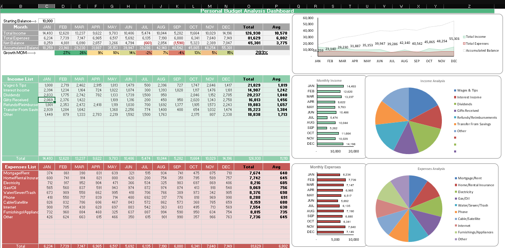

# 💰 Personal Budget Analysis Dashboard

This Excel dashboard provides an interactive and visual overview of personal budget management. It is designed to help individuals track income, expenses, savings, and monthly budget trends.

---

## 📊 Features

- Dynamic dashboards using PivotTables and PivotCharts
- Income vs Expense overview
- Monthly savings trends
- Categorized expense analysis
- Visual alerts for overspending
- Easy-to-use slicers and drop-down filters

---

## 🛠️ How to Use

1. Open the `Personal_Budget_Analysis_Dashboard.xlsx` file in Microsoft Excel (preferably 2016 or later).
2. Navigate through the dashboard tabs to explore:
   - Overview
   - Monthly Insights
   - Expense Categories
3. Use the filters and slicers to customize the view according to your selected month or category.

---

## 📌 Purpose

This project was built to demonstrate effective personal finance tracking using Excel’s built-in tools like:
- PivotTables
- Charts
- Conditional Formatting
- Data Validation

---

## 🧠 Learning Outcomes

- Advanced Excel visualization skills
- Budget tracking logic and layout
- Dashboard design best practices

---

## 📷 Preview

*You can optionally upload a screenshot of your dashboard and display it like this:*

---

## 📂 File

- `Personal_Budget_Analysis_Dashboard.xlsx` — main Excel dashboard

---

## ✨ Author

**Shaik Arshad**  
📧 arshad.shaik0499@gmail.com  
